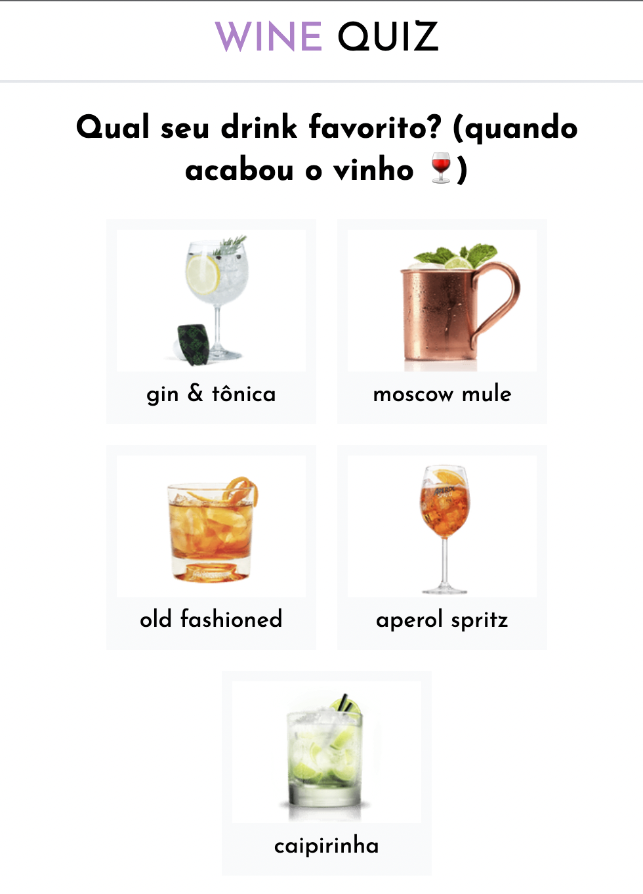
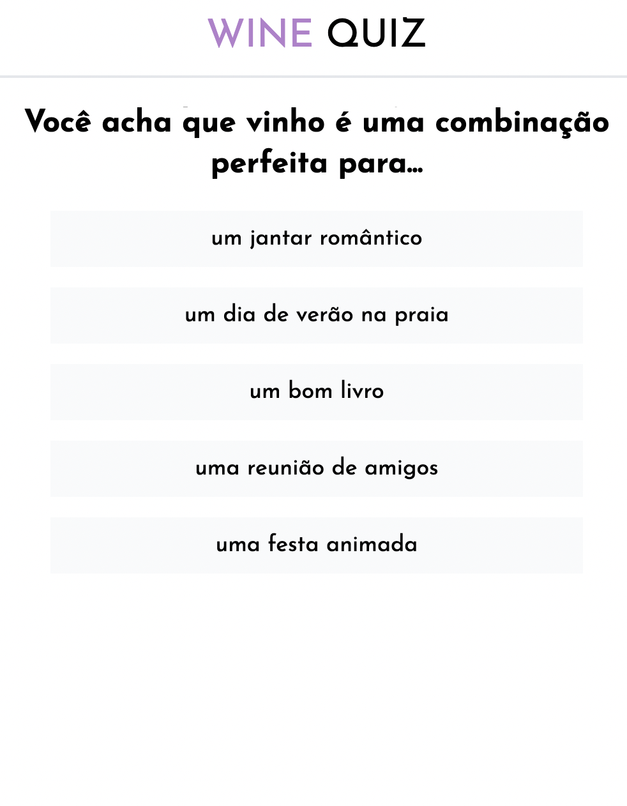
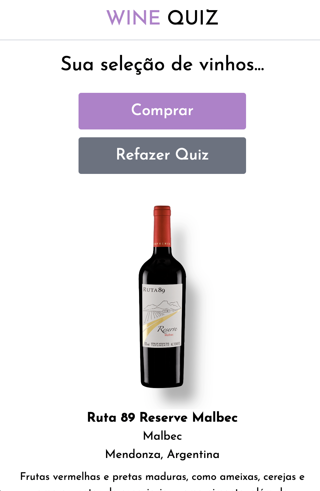

# Wine Quiz

An wine quiz built with React, Typescript, Redux Toolkit, GraphQl, Hygraph, Codegen and Apollo.
 
 
The user answer a few questions and get a 4 wine recommendation with a link to checkout in World Wine E-commerce.
 
<a href="https://wine-quiz.vercel.app/wines">Demo</a>
 
 

