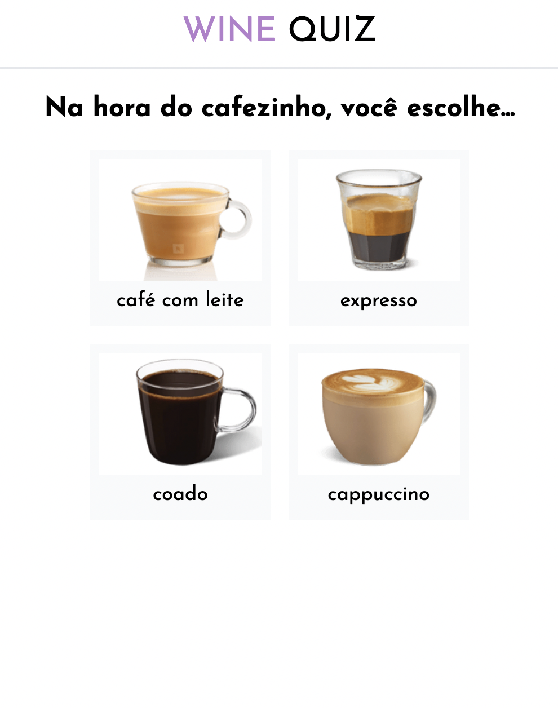

# Wine Quiz

A Wine Quiz built with React, Typescript, Redux Toolkit, Tailwindcss, GraphQl, Hygraph, Codegen, and Apollo.
 
 
The user answers a few questions and gets a four wine recommendation with a link to checkout in World Wine E-commerce.
 
 
<a href="https://wine-quiz.vercel.app">Demo</a>
 
 

